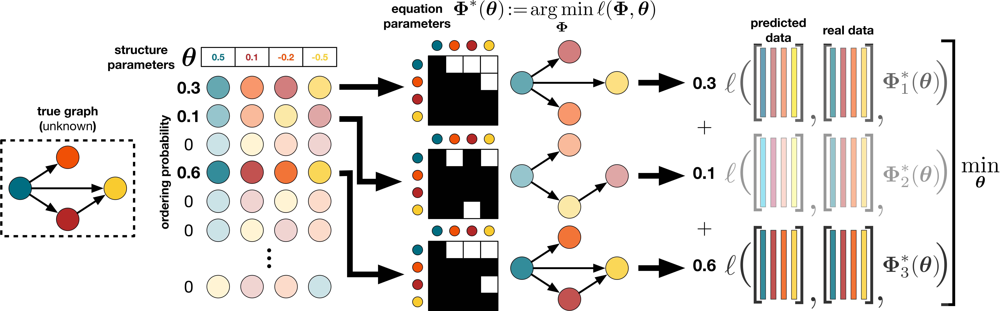

# DAGuerreotype: DAG Learning on the Permutahedron


## Installation instructions

The script `linux-install.sh` installs everything, assuming to be in an environment with `python>=3.9` 
with dev packages installed. 

Preliminary commands to install from scratch on ubuntu, including creating a DGE environment:

```shell
sudo apt install python3.9
sudo apt install python3.9-venv
sudo apt-get install python3.9-dev
python3.9 -m venv ~/envs/DGE
source ~/envs/DGE/bin/activate
# install torch with gpu capability with cuda 11.6
pip install torch torchvision torchaudio --extra-index-url https://download.pytorch.org/whl/cu116  
chmod +x linux-install.sh
./linux-install.sh
```

`linux-install.sh` executes the following steps:

- Download and unpack eigen package: https://gitlab.com/libeigen/eigen
- Download, unpack and install lp-sparsemap package: https://github.com/deep-spin/lp-sparsemap
- Build the current project


## Running instructions

The main script for running DAGuerreotype is `daguerreo.run_model.py`.
By default the following runs a bi-level optimization of SparseMAP + linear edge estimator on the Sachs dataset:
```bash
python -m daguerreo.run_model
```
For joint optimization add the joint argument

```bash
python -m daguerreo.run_model --joint
```

Use the `--structure` option to change structure estimator, e.g.,
```bash
python -m daguerreo.run_model --structure tk_sp_max
python -m daguerreo.run_model --structure rnd_rank
```

To use the LARS edge estimator (important: must set --sparsifier to none)
```bash
python -m daguerreo.run_model --structure tk_sp_max --equations lars --sparsifier none --nogpu
python -m daguerreo.run_model --structure sp_map --equations lars --sparsifier none --nogpu
```

For synthetic data (by default 10-nodes ER graph with linear Gaussian noise model) use the following
```bash
python -m daguerreo.run_model --joint --dataset synthetic
python -m daguerreo.run_model --dataset synthetic --graph_type BP --sem_type gumbel --num_nodes 50 --num_samples 2000 --noise_scale 0.3 --s0 1
```

To initialize the score vector of the order learners to the marginal variances use `--init_theta variances` (default is a vector of all 0s).

You can also add the following options:
- `--wand` to track and log results with WandB;
- `--nogpu` to force training on cpu;
- `--standardize` to standardize the data before learning (otherwise it is only 0-centered).

To replicate the results on Sachs and Syntren reported in the paper, run `real.sh`.

### Hyper-parameter Tuning
To carry out a Bayesian Optimization of the hyper-parameters using [optuna](https://optuna.org/) as described in Appendix D of the paper, run e.g.,

```bash
e="linear"
p="l0_ber_ste"
s="sp_map"
python -m daguerreo.hpo --dataset=synthetic --num_nodes=20 --project=hpo --joint --wandb --structure=$s --equations=$e --sparsifier=$p
```

## Available Modules
### Structure Estimators
Implemented structure learners are defined in `daguerreo/structures.py`:
1. `daguerreo.structures.SparseMapSVStructure`: SparseMAP operator for learning orderings on the Permutahedron
2. `daguerreo.structures.TopKSparseMaxSVStructure`: Top-K SparseMax operator for learning orderings on the Permutahedron
3. `daguerreo.structures.FixedVectorStructure`: module for using a fix ordering (random or true ordering)

They all return complete DAGs (later pruned by a sparsifier). New structures should extend `daguerreo.structures.Structure`.
#### Edge Estimators
Implemented edge estimators are defined in `daguerreo/equations.py`:
1. `daguerreo.equations.LinearEquations`: differentiable linear layer X -> X W
2. `daguerreo.equations.NonlinearEquations`: differentiable one-hidden-layer network with leaky ReLU activation
3. `daguerreo.equations.LARSAlgorithm`: non-differentiable regressor as described in [Beware of the Simulated DAG! Causal Discovery Benchmarks May Be Easy To Game](https://arxiv.org/abs/2102.13647)

New estimators should extend `daguerreo.equations.Equations`.

#### Edge Sparsifiers
Implemented edge sparsifiers are defined in `daguerreo/sparsifiers.py`:
1. `daguerreo.sparsifiers.BernoulliSTEL0Sparsifier`: L0 pruner parametrized by a Bernouilli per edge and using the Straight-Through Estimator
2. `daguerreo.sparsifiers.NoSparsifier`: dummy module when no sparsifier is wanted/needed

New sparsifiers should extend `daguerreo.sparsifiers.Sparsifier`.

## Bibtex
```bibtex
@inproceedings{zantedeschi2023dag,
  title={DAG Learning via Sparse Relaxations},
  author={Zantedeschi, Valentina and Franceschi, Luca and Kaddour, Jean and Kusner, Matt and Niculae, Vlad},
  booktitle={International Conference on Learning Representations},
  year={2023}
}
```